# Corona management system for the HMO - מערכת לניהול קורונה לקופת חולים
## Chany Weber - חני וובר ת.ז:213496060 


# 1. התקנות ותלויים חיצונים 

המערכת פותחה בסביבת העבודה visual studio code 
ליצירת schama של הטבלות והתחברות ל mongoDB
הותקנו הספריות הבאות לצורך התחברות למסד הנתונים

```bash
$ npm install --save mongoose
```

```bash
$ npm install --save express
```

```bash
$ npm install --save dotenv
```

בנוסף על כל אחד החפץ להתחבר למערכת יש לשנות את כתובת ההתחברות למסד הנתונים המותאמת לו ב URL שבדף .env

יש להכניס ערכים לטבלאות ע"פ הדרישות הקימות והפורמט המקובל

# 2. אופן השימוש וגישה לנתונים - API

הצגת כל חברי קופת החולים - פונקציית get

```yaml
    localhost:8919/HMOcustomers
```
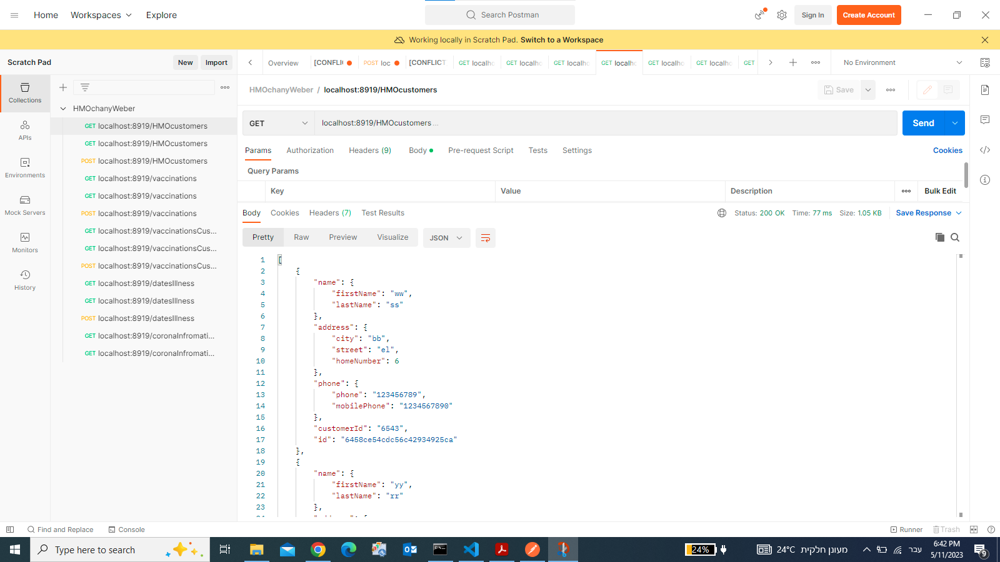;

הצגת חבר קובת חולים אחד -פונקציית get
```yaml
    localhost:8919/HMOcustomers/:id
```
;

הוספת חבר קופת חולים חדש - פונקציית post
```yaml
    localhost:8919/HMOcustomers
```
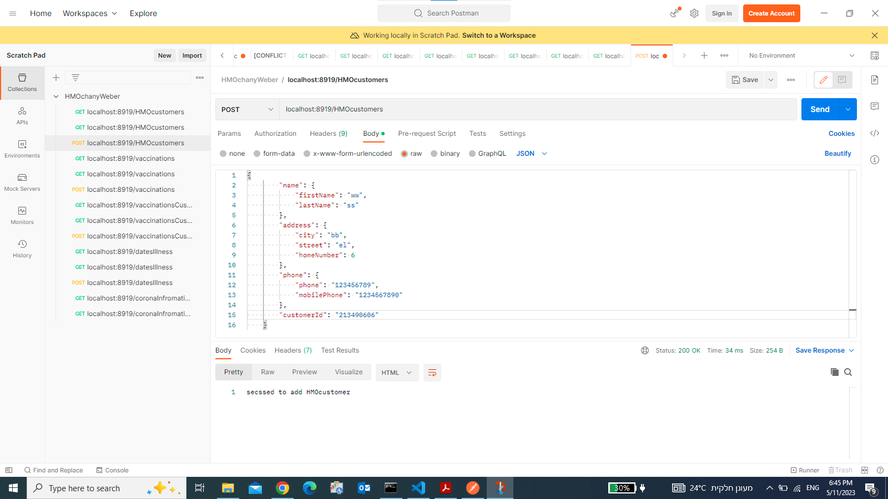;

הצגת כל סוגי החיסונים ופרטיהם - פונקציית get
```yaml
    localhost:8919/vaccinations
```
;

הצגת פרטי חיסוד בודד - פונקציית get
```yaml
    localhost:8919/vaccinations/code
```
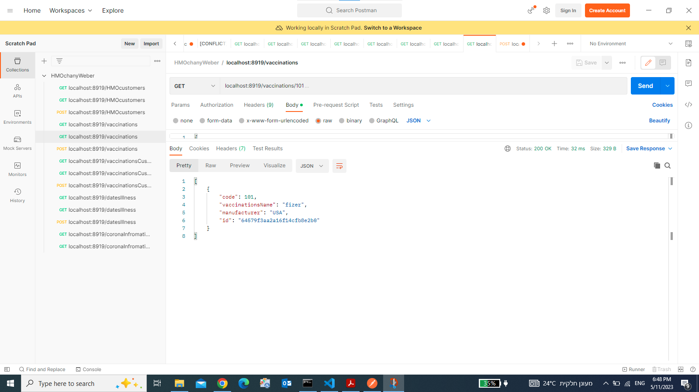;

הוספת חיסון חדש - פונקציית post
```yaml
    localhost:8919/vaccinations
```
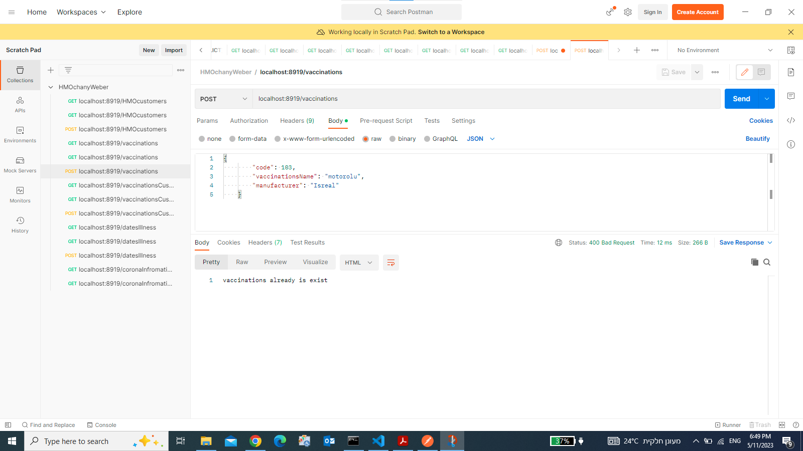;

הצגת כל החברים המחוסנים בקופת החולים עם פרטי החיסון - פונקציית get
```yaml
    localhost:8919/vaccinationsCustomers
```
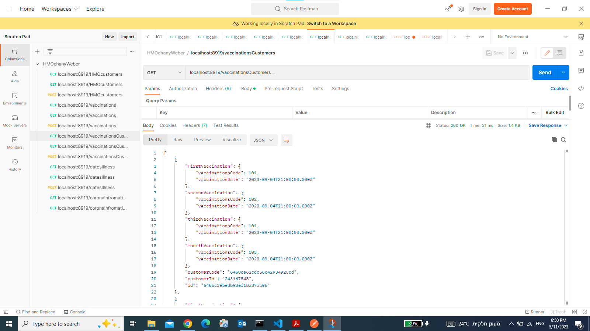;

הצגת פרטי חיסון ללקוח אחד - פונקציית get
```yaml
    localhost:8919/vaccinationsCustomers/:id
```
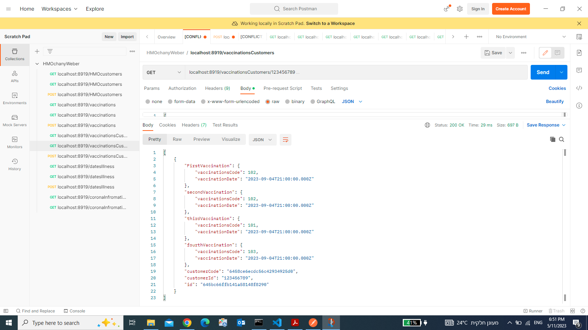;

הוספת פרטי חיסונים לחבר קופת חולים - פונקציית post
```yaml
    localhost:8919/vaccinationsCustomers
```
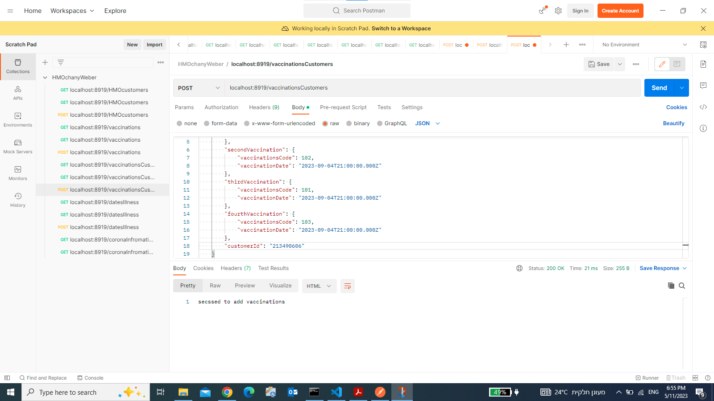;

הצגת פרטי מחלת ובדיקות קורונה לחברי קופת החולים- פונקציית get
```yaml
    localhost:8919/datesIllness
```
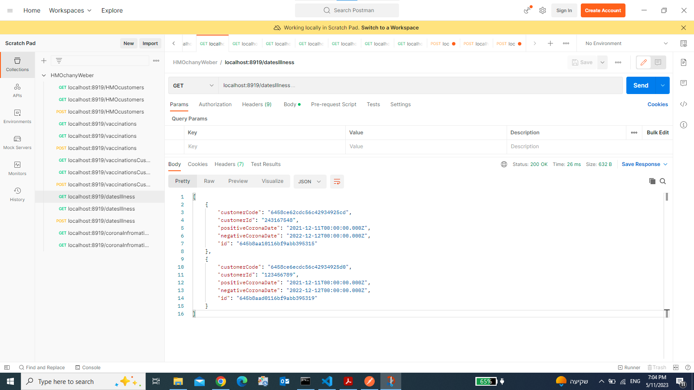;

הצגת פרטי מחלה ובדיקות קורונה לחבר קופת חולים אחד - פונקציית get
```yaml
    localhost:8919/datesIllness/:id
```
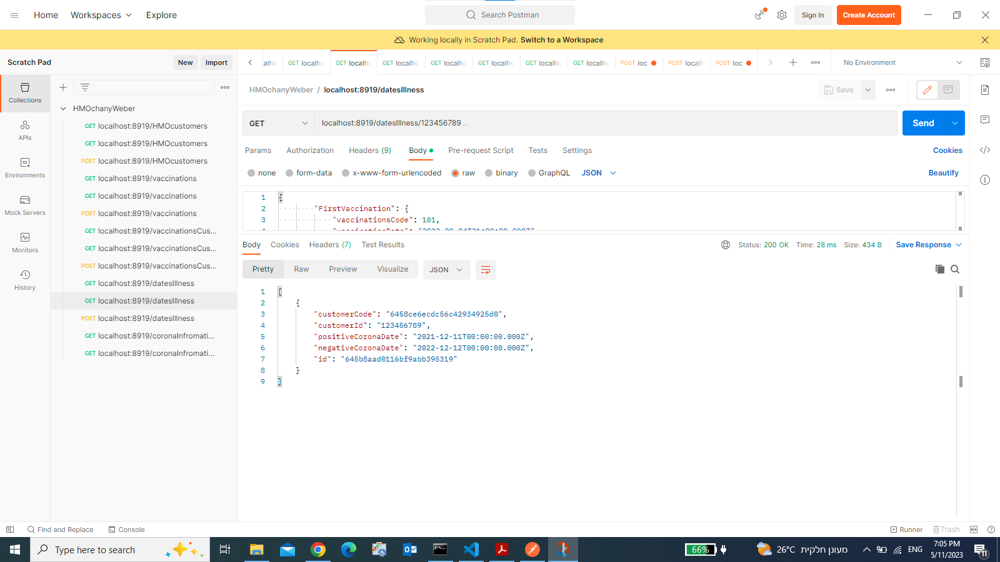;

הוספת פרטי בדיקות קורונה לחבר בקופת החולים - פונקציית post
```yaml
    localhost:8919/datesIllness
```
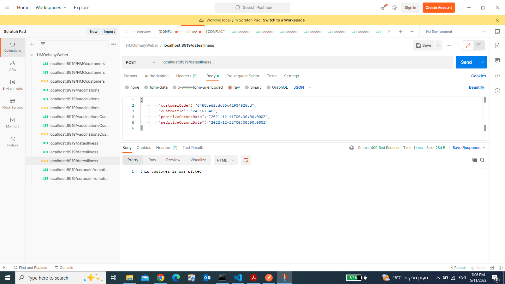;

הצגת פרטי כל המידע על כל חברי קופת החולים- פונקציית get
```yaml
    localhost:8919/coronaInfromationCustomers
```
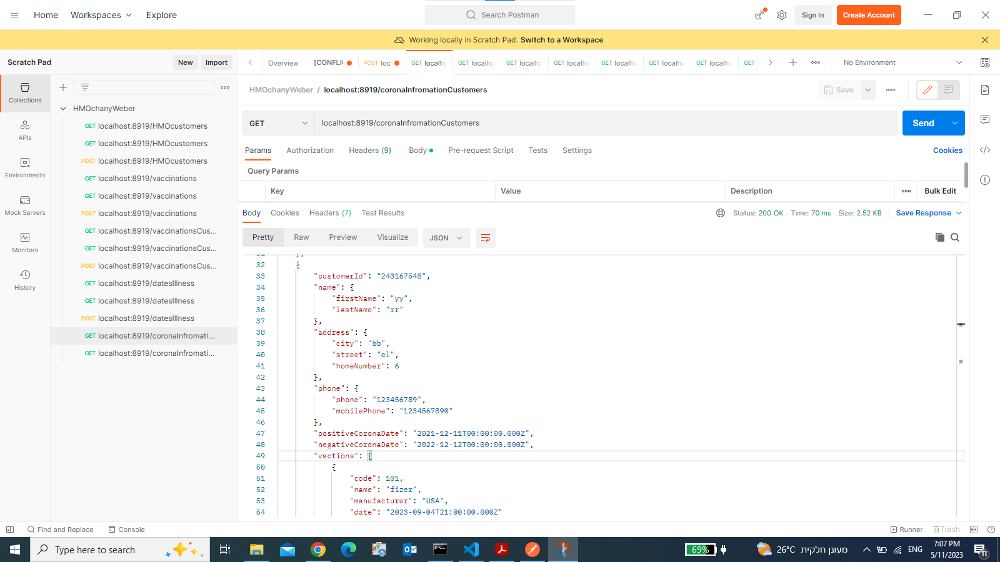;

הצגת פרטי כל המידע על כל חבר אחד בקופת החולים- פונקציית get
```yaml
    localhost:8919/coronaInfromationCustomers/:id
```
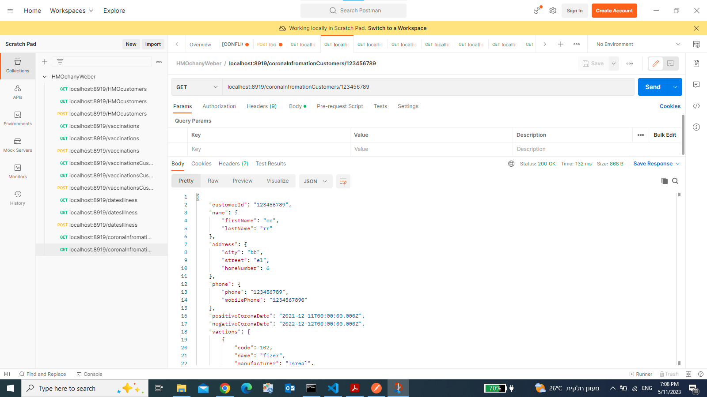;
